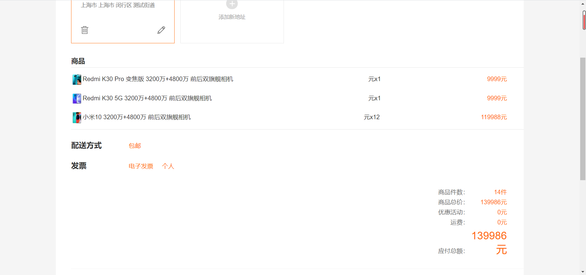
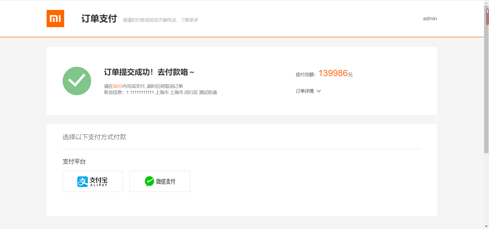

# python django仿小米商城后端服务
## 介绍

模拟小米官网的后端服务

项目运行环境

| python       | 3.11+  |
|--------------|--------|
| Django       | 5.1.1  |
| djangorestframework   | 3.15.2 |
| PyMySQL | 1.1.1+ |
| mysql        | 5.7+   |
| jwt        | 1.3.1  |


## 后端运行先配置数据库（mysql 和redis）

[代码地址Gitee](https://gitee.com/gitxys/mi_django)

[代码地址GitHub](https://github.com/xuyisu/mi_django)

```
DATABASES = {
    # 'default': {
    #     'ENGINE': 'django.db.backends.sqlite3',
    #     'NAME': BASE_DIR / 'db.sqlite3',
    # }
    'default': {
        'ENGINE': 'django.db.backends.mysql',
        'NAME': 'mi_mall',
        'USER': 'root',
        'PASSWORD': '123456',
        'HOST': '127.0.0.1',
        'PORT': 3306
    }
}
```


点击启动类启用服务

```
def main():
    """Run administrative tasks."""
    os.environ.setdefault('DJANGO_SETTINGS_MODULE', 'mi_django.settings')
    try:
        from django.core.management import execute_from_command_line
    except ImportError as exc:
        raise ImportError(
            "Couldn't import Django. Are you sure it's installed and "
            "available on your PYTHONPATH environment variable? Did you "
            "forget to activate a virtual environment?"
        ) from exc
    execute_from_command_line(sys.argv)


if __name__ == '__main__':
    main()
```
## 后端启动
安装依赖包
```
pip install -r requirements.txt
```
启动服务
```
python manage.py runserver
```
## 其他语言后端地址

| 名称                       | Gitee                                      | Github                                      |
| -------------------------- | ------------------------------------------ | ------------------------------------------- |
| mi_springboot (Java)       | https://gitee.com/gitxys/mi_springboot     | https://github.com/xuyisu/mi_springboot     |
| mi-beego (Golang)          | https://gitee.com/gitxys/mi-beego          | https://github.com/xuyisu/mi-beego          |
| mi-gin (Golang)            | https://gitee.com/gitxys/mi-gin            | https://github.com/xuyisu/mi-gin            |
| mi_django (Python)         | https://gitee.com/gitxys/mi_django         | https://github.com/xuyisu/mi_django         |
| mi_fastapi (Python)        | https://gitee.com/gitxys/mi_fastapi        | https://github.com/xuyisu/mi_fastapi        |
| mi_koa_nodejs (nodejs)     | https://gitee.com/gitxys/mi_koa_nodejs     | https://github.com/xuyisu/mi_koa_nodejs     |
| mi_express_nodejs (nodejs) | https://gitee.com/gitxys/mi_express_nodejs | https://github.com/xuyisu/mi_express_nodejs |
| mi_egg_nodejs (nodejs)     | https://gitee.com/gitxys/mi_egg_nodejs     | https://github.com/xuyisu/mi_egg_nodejs     |
|                            |                                            |                                             |


## 前端启动

项目地址https://gitee.com/gitxys/mi_vue

[代码地址Gitee](https://gitee.com/gitxys/mi_vue)

[代码地址GitHub](https://github.com/xuyisu/mi_vue)

控制台先安装依赖包

```
npm install 
```

然后运行下面代码即可启动

```
npm run serve
```

## 页面介绍

浏览器输入http://localhost:8080 将看到一下页面


登录:**用户名/密码**  admin/123456


购物车


订单确认



订单结算(彩蛋！！！！   这里的结算做了特殊处理)



订单列表


亲，留个star 吧
